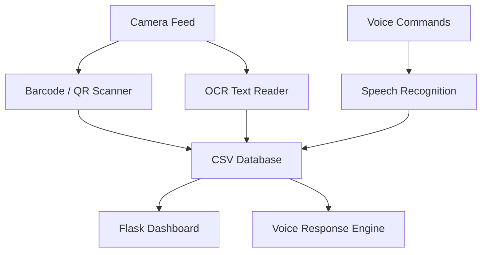

# Smart Vision System – Item Tracking

A smart inventory and item tracking system that combines **Computer Vision**, **OCR**, **Barcode/QR Scanning**, **Speech Recognition**, and a **Web Dashboard** for real-time product monitoring.

Developed by **Endri Dibra** as a 3-day technical challenge project for an interview process.

---

## Table of Contents

1. Overview
2. Features
3. Technologies Used
4. System Architecture
5. Installation
6. Quick Start
7. Usage Modes
8. Project Structure
9. How It Works
10. Web Dashboard
11. Voice Assistant Commands
12. Troubleshooting
13. Future Improvements
14. License

---

## Overview

This project is a smart item/product tracking solution designed to automate inventory logging and retrieval using modern AI-assisted interfaces.

The system can:

- Detect and scan **QR codes** and **barcodes**
- Extract printed text from images using **OCR**
- Store scanned items in a CSV database
- Provide item lookup via **voice assistant**
- Display all tracked products in a web dashboard
- Improve Human-Computer Interaction through voice control

---

## Features

### Computer Vision

- Live camera barcode scanning
- QR code recognition
- Real-time item detection overlay
- OCR text extraction from images

### Data Management

- CSV-based lightweight storage
- Duplicate item prevention
- Timestamp logging
- Searchable records

### Voice Technology

- Speech-to-Text commands
- Text-to-Speech responses
- Hands-free inventory lookup

### Web Interface

- Flask-powered dashboard
- Search items instantly
- Tabular product history view

---

## Technologies Used

| Category | Libraries |
|--------|-----------|
| Computer Vision | OpenCV, pyzbar |
| OCR | pytesseract |
| Data Processing | pandas, numpy |
| Web UI | Flask, HTML, CSS |
| Speech Recognition | SpeechRecognition |
| Text-to-Speech | pyttsx3 |

---

## System Architecture



---

## Installation

### Install Tesseract OCR

#### Windows

Download:
https://github.com/UB-Mannheim/tesseract/wiki

#### Ubuntu

```bash
sudo apt install tesseract-ocr
```

---

## Quick Start

Run the project:

```bash
python smartTracking.py
```

You will see:

```text
1. Run QR/Barcode Scanner
2. Run Voice Assistant
3. Run Web Dashboard
4. OCR Scan From Image
5. Exit
```

---

## Usage Modes

---

### 1. QR / Barcode Scanner

Launch live camera scanning:

```text
Choose option: 1
```

Features:

- Detects barcodes instantly
- Saves unique items automatically
- Draws green detection boundaries

---

### 2. Voice Assistant

Launch voice search:

```text
Choose option: 2
```

Example commands:

- Where is item 12345
- Find item box12
- Status of item 998
- Stop

System responds with latest location and timestamp.

---

### 3. Web Dashboard

Launch browser UI:

```text
Choose option: 3
```

Then open:

```text
http://127.0.0.1:5000
```

---

### 4. OCR Image Scanner

Extract printed text from image:

```text
Choose option: 4
Enter image path: image.jpg
```

---

## Project Structure

```text
Smart_Vision_System_Item_Tracking/
│── smartTracking.py
│── Items.csv
│── templates/
│   └── dashboard.html
│── README.md
```

---

## How It Works

### Barcode / QR Flow

```text
Camera → pyzbar Decoder → Item ID → CSV Storage
```

### OCR Flow

```text
Image → OpenCV → Tesseract OCR → CSV Storage
```

### Voice Flow

```text
Microphone → Speech Recognition → Search CSV → TTS Response
```

---

## Web Dashboard

The dashboard provides:

- Search bar
- Product records
- Timestamp history
- Latest locations

Useful for warehouse, office, or store inventory.

---

## Voice Assistant Commands

| Command Example | Action |
|----------------|--------|
| Where is item 1001 | Search item |
| Find box23 | Search item |
| Stop | Exit assistant |

---

## Troubleshooting

### Camera Not Opening

Try changing:

```python
cv2.VideoCapture(0)
```

to:

```python
cv2.VideoCapture(1)
```

---

### Microphone Not Detected

Install PyAudio:

```bash
pip install pyaudio
```

---

### OCR Not Working

Ensure Tesseract is installed and added to PATH.

---

## Future Improvements

- SQL database integration
- Cloud inventory sync
- Face authentication
- Multi-camera support
- Mobile app dashboard
- AI anomaly detection

---

## License

This project was created by **Endri Dibra** for portfolio and technical demonstration purposes.

---
